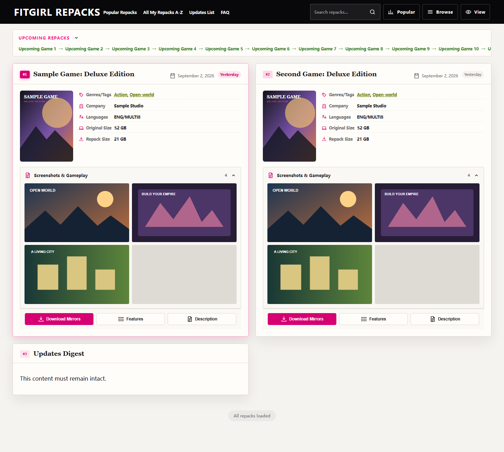
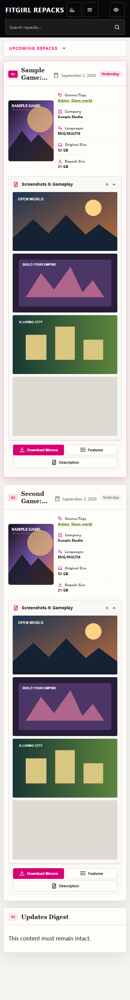
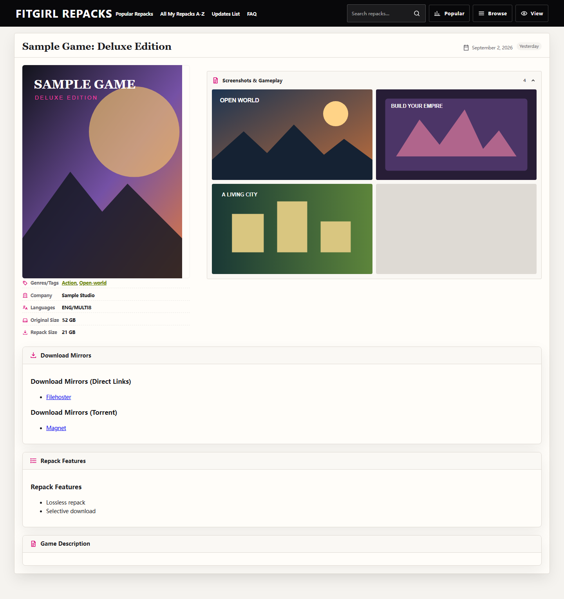
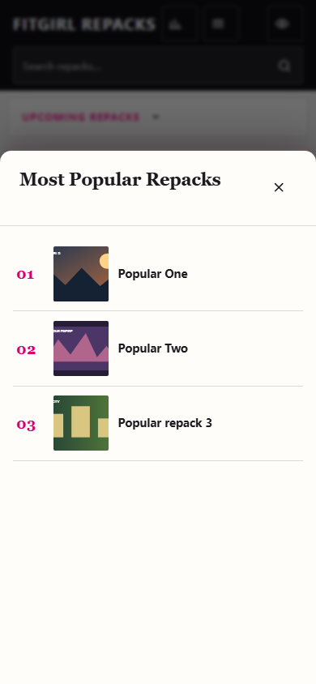
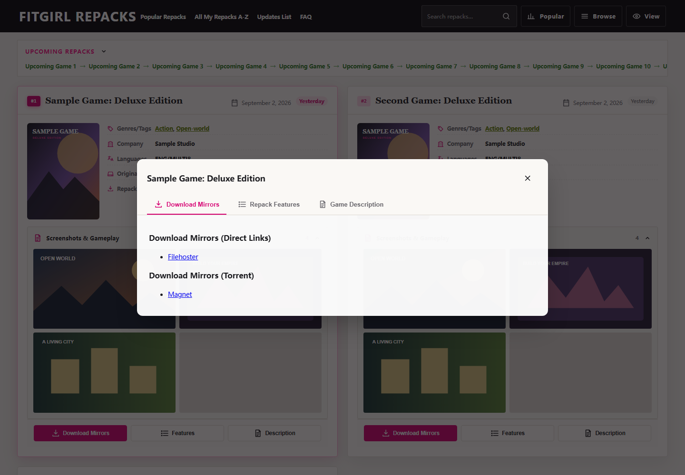

# FitGirl Web Enhanced

<p align="center">
  <a href="https://github.com/red352/fitgirl-web-enhanced/releases"></a>
  <a href="LICENSE"></a>
  <a href="https://fitgirl-repacks.site/"></a>
  <a href="#权限与隐私安全"></a>
  <a href="package.json"></a>
</p>

<p align="center">
  面向 <strong>FitGirl Repacks</strong> 的现代化、轻量级且无损可逆的用户脚本（Userscript）。<br />
  在严格保留站点所有原始正文、下载镜像、视频截图与 Magnet 链接的前提下，通过工程化手段重构网格排版与阅读体验。
</p>

<p align="center">
  <a href="https://raw.githubusercontent.com/red352/fitgirl-web-enhanced/master/dist/fitgirl-enhanced.user.js"><strong>🚀 一键安装 Userscript</strong></a> ·
  <a href="https://cdn.jsdelivr.net/gh/red352/fitgirl-web-enhanced@master/dist/fitgirl-enhanced.user.js">备用 CDN 安装</a> ·
  <a href="https://github.com/red352/fitgirl-web-enhanced/issues">反馈问题 / 提交建议</a>
</p>

---

## 目录

- [项目概述](#项目概述)
- [核心特性](#核心特性)
- [界面预览](#界面预览)
- [安装指南](#安装指南)
- [交互与快捷键](#交互与快捷键)
- [技术架构与设计原则](#技术架构与设计原则)
- [权限与隐私安全](#权限与隐私安全)
- [兼容性](#兼容性)
- [本地开发与测试](#本地开发与测试)
- [常见问题与排障](#常见问题与排障)
- [贡献指南](#贡献指南)
- [免责声明与开源许可](#免责声明与开源许可)

---

## 项目概述

FitGirl Repacks 原版页面基于经典博客流式布局，在现代高分辨率显示器或宽屏设备上存在屏幕利用率低、图文混排篇幅过长、长列表浏览易疲劳等问题。

**FitGirl Web Enhanced** 采用渐进增强策略，在不依赖任何特权脚本权限（`@grant none`）的纯前端沙箱环境下工作：

- **布局重构**：将冗长的文章流重塑为行对齐的自适应栅格卡片，大幅提升信息检索效率。
- **无损可逆**：底层采用双向事务记录器，不破坏原始 DOM 结构与原生属性，支持随时一键回退至原生视图。
- **即插即用**：零外部依赖，支持主流浏览器脚本管理器，具备静默自更新机制。

---

## 核心特性

### 1. 严格行拉齐网格流（Row-Aligned Grid Flow）

- **基准行等高拉齐**：采用标准 CSS Grid 布局，每行卡片顶部与底部高度严格对齐（`align-items: stretch`），消除错落瀑布流导致的阅读基线跳跃与新旧顺序混淆。
- **视口断点响应**：
  - **移动端 / 紧凑视口（< 1152px）**：单列自适应流式排版；
  - **标准桌面 / 笔记本（1152px ~ 1699px）**：双列平衡卡片流；
  - **2K / 宽屏显示器（1700px ~ 2399px）**：自适应三列平铺；
  - **4K / 超宽屏显示器（≥ 2400px）**：自适应四列高密度排版。
- **时序权重标识**：
  - 首张最新发布的游戏卡片配有专属光晕高亮；
  - 前三位发布条目使用梯级品红徽章（`#1`, `#2`, `#3`）标定优先级；
  - 卡片顶部包含人性化相对发布时间标签（如 `Today`、`Yesterday`、`2d ago` 等）。
- **海报原比呈现**：游戏封面采用 `object-fit: contain`，杜绝边缘标题与细节截断。

### 2. 无缝无限滚动（Infinite Scroll）

- 向下滚动接近页面底部时，后台平滑预加载下一页资源并按行追加至列表底部，杜绝页面跳动与重排。
- 在顶部 **View** 控制菜单中提供持久化开关（默认启用），关闭后无损恢复原生数字分页导航。

### 3. 多媒体交互灯箱（Lightbox）

- 点击任何截图或视频缩略图即可呼出全屏灯箱，支持即时低清占位并异步平滑切换至高清原图。
- 完整支持原生 `<video>` 演示动画循环播放。
- 深度集成桌面交互：鼠标指针焦点平滑缩放、双击放大/重置、按住平移浏览高分辨率局部细节，以及完整键盘快捷键操作。

### 4. 模态详情与结构收纳

- **列表卡片快捷弹窗**：卡片底部集成 `Download Mirrors`、`Features`、`Description` 快捷触发键，无需离开列表即可在模态弹窗中快速查阅下载链接与详细说明。
- **详情页轻量折叠**：下载源与网盘镜像聚合为标准 Disclosure 折叠块，默认收起特性与介绍，大幅精简页面初次呈现高度。
- **结构规范化**：自动隔离 WordPress 清除浮动伪元素与游离广告节点，避免非预期空白占位；`Upcoming Repacks` 始终全宽吸顶居中。

### 5. 统一导航与抽屉容器

- **热门榜单解耦**：将原常驻侧边栏的 `Most Popular Repacks of the Week` 改为桌面端右侧抽屉、移动端底部抽屉（Bottom Sheet），按需呼出。
- **全局路由面板**：顶部导航提供 **Browse** 下拉面板，快速访问站点常用分类、A-Z 索引与按月历史归档。
- **全站风格一致性**：对搜索结果页、Updates Digest、归档页等特殊页面提供统一的响应式风格适配。

### 6. 零闪烁加载与状态持久化

- 基于 `@run-at: document-start` 注入与同步 Fast-Path 状态预检，在 DOM 解析初期即注入视图控制属性，彻底消除无样式内容闪烁（FOUC）。
- 偏好设置采用 `localStorage` 与 `IndexedDB` 双层容错存储，跨会话与多标签页保持同步。

---

## 界面预览

> 界面预览截图基于当前 v1.4.1 构建产物在标准环境及各典型视口下由自动化驱动真实渲染拍摄。

|           桌面浏览页（网格流与卡片）           |                 移动端浏览页                  |
| :--------------------------------------------: | :-------------------------------------------: |
|  |  |

|       桌面详情页（折叠收纳与媒体展示）        |           移动端热门榜单（抽屉面板）            |
| :-------------------------------------------: | :---------------------------------------------: |
|  |  |

|     卡片快捷模态弹窗（快速查阅下载镜像与特性）     |
| :------------------------------------------------: |
|  |

---

## 安装指南

### 前置要求

在浏览器中安装任意一款支持现代 Userscript 规范的脚本管理器扩展：

- [Tampermonkey](https://www.tampermonkey.net/)（推荐，Chrome / Edge / Firefox / Safari）
- [Violentmonkey](https://violentmonkey.github.io/)
- [Greasemonkey](https://www.greasespot.net/)

### 安装步骤

1. 点击安装链接：[Raw 脚本安装](https://raw.githubusercontent.com/red352/fitgirl-web-enhanced/master/dist/fitgirl-enhanced.user.js)（国内网络环境可选 [jsDelivr 镜像](https://cdn.jsdelivr.net/gh/red352/fitgirl-web-enhanced@master/dist/fitgirl-enhanced.user.js)）；
2. 脚本管理器将自动弹出确认界面，点击 **安装**（Install）；
3. 访问 [fitgirl-repacks.site](https://fitgirl-repacks.site/)，页面将自动以增强模式呈现。

### 自动更新

脚本在元数据头中声明了 `@updateURL` 与 `@downloadURL`。每次脚本仓库发布新版本后，脚本管理器会在后台检测版本差异并提示自动升级。

---

## 交互与快捷键

### 多媒体灯箱快捷键

| 快捷键                                                        | 功能操作                         |
| :------------------------------------------------------------ | :------------------------------- |
| <kbd>←</kbd>                                                  | 切换至上一张截图 / 媒体          |
| <kbd>→</kbd>                                                  | 切换至下一张截图 / 媒体          |
| <kbd>+</kbd> / <kbd>=</kbd> 或 <kbd>Ctrl</kbd> + <kbd>+</kbd> | 放大当前视图                     |
| <kbd>-</kbd> 或 <kbd>Ctrl</kbd> + <kbd>-</kbd>                | 缩小当前视图                     |
| <kbd>0</kbd> 或 <kbd>Ctrl</kbd> + <kbd>0</kbd>                | 重置缩放与位移为原始比例（1.0x） |
| <kbd>Esc</kbd>                                                | 退出全屏灯箱                     |

### 鼠标与手势交互

- **缩放**：在灯箱开启状态下，使用鼠标滚轮可按当前指针所在焦点进行无级平滑缩放。
- **快速缩放**：双击图片可在原始比例与 2.2 倍放大倍率之间快速切换。
- **拖拽平移**：当图片放大处于视口之外时，按住鼠标左键即可自由拖拽平移画布。
- **模态窗口导航**：所有弹窗与抽屉均支持按 <kbd>Esc</kbd> 快速关闭，或点击背景半透明遮罩层关闭。

---

## 技术架构与设计原则

```
src/
├── dom.ts          # DOM 解析器、正文栏目提取、页面特征识别与双向还原事务管理器
├── ui.ts           # 响应式卡片流、媒体墙、模态弹窗、导航抽屉与 Lightbox 控制器
├── preferences.ts  # 同步 Fast-Path 偏好注入、localStorage / IndexedDB 容错持久化
├── types.ts        # 全局 TypeScript 接口与领域模型定义
├── icons.ts        # 内联 SVG 图标生成器
├── style.css       # 媒体查询、容器查询与基于作用域隔离的样式定义
└── main.ts         # 生命周期初始化入口与运行时沙箱引导
```

- **双向事务记录器（Reversible Transactions）**：
  增强脚本对页面的结构调整并非破坏性修改，而是通过事务记录器捕获节点的原始父级容器、兄弟节点相对位置、行内样式与原始 Class。当切换至 `Original View` 时，事务以逆序精确执行还原，保证与原生页面 100% 一致。
- **动态 Mutation 隔离**：
  内部采用 `WeakSet` 与专用标记属性追踪已处理的 DOM 节点，在无缝无限滚动加载或外部脚本注入时，仅增量处理全新节点，避免重复计算或嵌套包装。
- **样式作用域隔离**：
  所有增强 CSS 样式严格限定在 `html[data-fwe-mode="enhanced"]` 选择器作用域下，确保在原站视图下不残留任何全局样式污染。

---

## 权限与隐私安全

- **零特权声明（`@grant none`）**：脚本不请求、不使用任何高级脚本管理器 API，运行环境与普通网页脚本完全一致。
- **零外部请求与数据上报**：除浏览器加载页面自身包含的图片资源外，脚本不向任何第三方服务器发送网络请求，不收集任何用户浏览数据或访问凭据。
- **同源存储隔离**：本地配置仅保存在站点同源的 `localStorage` 与 `IndexedDB` 中，键名分别为：
  - `fitgirl-web-enhanced:v1:layout-mode`：视图模式配置（`enhanced` / `original`）；
  - `fitgirl-web-enhanced:v1:media-expand`：详情页媒体默认展开偏好；
  - `fitgirl-web-enhanced:v1:infinite-scroll`：列表页无限滚动开关状态。

---

## 兼容性

| 运行环境       | 兼容支持说明                                                                    |
| :------------- | :------------------------------------------------------------------------------ |
| **脚本管理器** | Tampermonkey、Violentmonkey、Greasemonkey 等兼容标准 Userscript 规范的扩展      |
| **浏览器内核** | Chromium 系（Chrome, Edge, Brave, Vivaldi）、Firefox 等最新主流稳定版           |
| **视口跨度**   | 覆盖 390px 移动端单列至 4K+ 超宽屏四列自适应排版                                |
| **异常降级**   | 当 DOM 结构发生未知变更或脚本运行异常时，自动安全降级至原站排版，不影响正文显示 |

---

## 本地开发与测试

### 环境依赖

- [Node.js](https://nodejs.org/) `>= 22.12`
- [npm](https://www.npmjs.com/)

### 工作流命令

```bash
# 安装依赖
npm ci

# 启动本地热重载开发服务
npm run dev

# 静态类型检查
npm run typecheck

# 代码规范检查与格式校验
npm run lint
npm run format:check

# 执行单元测试
npm run test

# 构建生产产物（输出至 dist/fitgirl-enhanced.user.js）
npm run build

# 执行 Playwright 端到端及视觉快照测试
npm run test:e2e

# 自动化重拍文档高清预览图（输出至 docs/assets/）
npm run capture

# 综合前置检查（流水线推荐）
npm run check
```

---

## 常见问题与排障

### Q1: 安装脚本后页面样式未发生变化？

- 请确认当前访问的 URL 是否严格匹配 `https://fitgirl-repacks.site/*`；
- 确认脚本管理器中该脚本已处于“启用”状态；
- 若此前曾切换至原生视图，请点击页面右下角的恢复图标，或在控制台执行 `localStorage.clear()` 重置配置。

### Q2: 为什么个别非游戏文章未呈现为网格卡片？

- Updates Digest、公告通知或特殊格式文章由于不包含标准 Repack 信息段，脚本会主动采用保真全宽布局，以防止漏读关键文本或损坏排版。

### Q3: 站点改版后遇到排版错位如何反馈？

- 建议先通过顶部 **View** 菜单切换至 **Original View** 保证正常访问；
- 欢迎前往 [GitHub Issues](https://github.com/red352/fitgirl-web-enhanced/issues) 提交工单，并附上具体页面链接、浏览器版本及控制台错误日志截图。

---

## 贡献指南

欢迎任何有助于完善本项目体验的贡献！

1. Fork 本仓库并基于最新代码创建分支；
2. 遵循现有的 ESLint 与 Prettier 代码规范；
3. 提交前确保通过 `npm run check` 与 `npm run test:e2e`；
4. 提交清晰、规范的 Git 提交说明（推荐语义化提交，如 `feat: ...`, `fix: ...`）。

---

## 免责声明与开源许可

### 免责声明

本脚本仅属于个人开发用于改善网页排版与本地浏览体验的无侵入式前端增强工具。

- 脚本自身不托管、不存储、不解析、亦不分发任何受版权保护的二进制文件、种子或数据流。
- 脚本与 FitGirl Repacks 官方无任何隶属或雇佣关系。
- 使用者应自行遵守所在国家/地区法律法规，作者不对任何第三方链接的有效性或使用者的行为承担法律责任。

### 开源许可

本项目基于 [MIT 许可证](LICENSE) 授权开源。<br />
Copyright © 2026 red352
